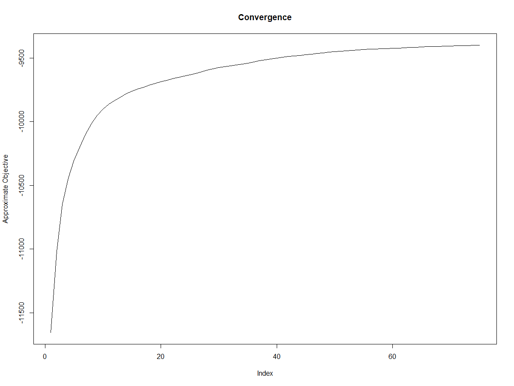
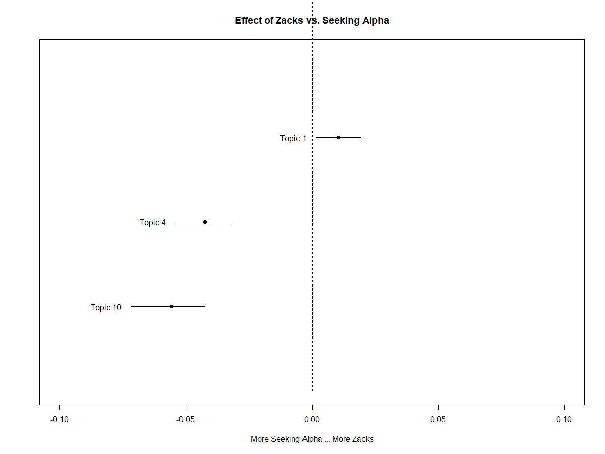
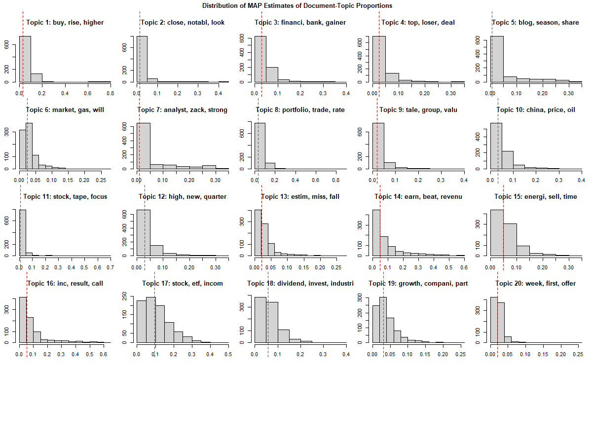
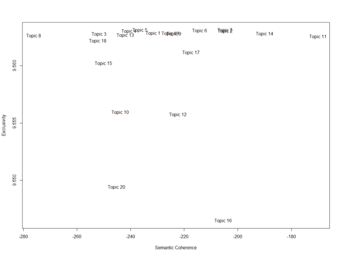

# Structural-Topic-Modeling-in-R

# Code
https://github.com/trajceskijovan/Structural-Topic-Modeling-in-R/blob/main/Topical_Model_Jovan_Trajceski_May%202021.R

# Medium Articles
I have written two Medium articles on this topic.

Structural Topic Modeling with R — Part I:

https://jovantrajceski.medium.com/structural-topic-modeling-with-r-part-i-2da2b353d362

Structural Topic Modeling with R — Part II:

https://jovantrajceski.medium.com/structural-topic-modeling-with-r-part-ii-462e6e07328

