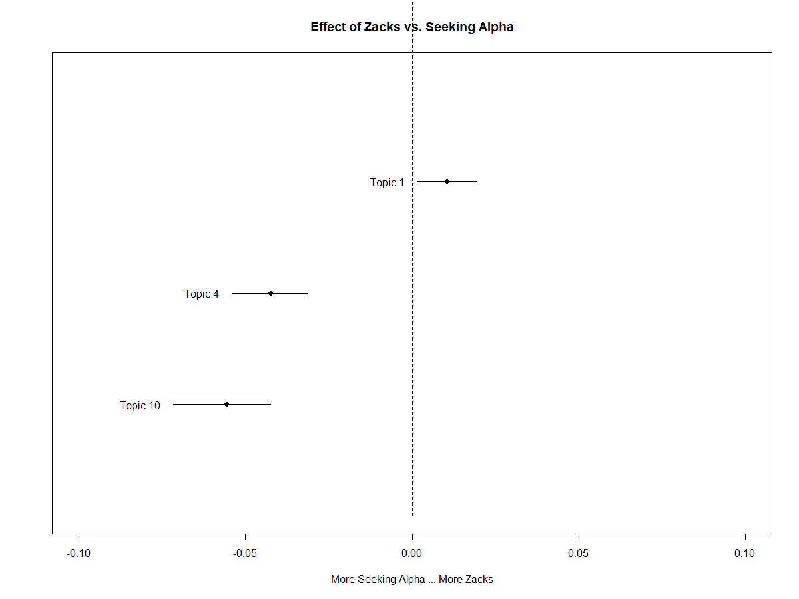
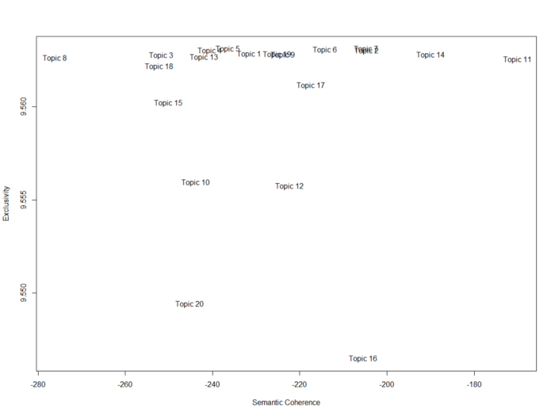

# Structural-Topic-Modeling-in-R

Topic models allow us to summarize unstructured text, find clusters (hidden topics) where each observation or document (in our case, news article) is assigned a (Bayesian) probability of belonging to a specific topic.
The most common form of topic modeling is LDA (Latent Dirichlet Allocation). Other techniques exist, such as Dynamic Topic Models, Correlated Topic Models, Hierarchical Topic Models.

Structural topic modeling (STM) has been increasing in popularity over recent years. STM is essentially LDA that employs metadata to improve word assignment to topics within a corpus (collection of news articles).

So we can easily say, STM = LDA + metadata.

# Code
https://github.com/trajceskijovan/Structural-Topic-Modeling-in-R/blob/main/Topical_Model_Jovan_Trajceski_May%202021.R

# Medium Articles
I have written two Medium articles on this topic.

Structural Topic Modeling with R — Part I:

https://jovantrajceski.medium.com/structural-topic-modeling-with-r-part-i-2da2b353d362

Structural Topic Modeling with R — Part II:

https://jovantrajceski.medium.com/structural-topic-modeling-with-r-part-ii-462e6e07328

