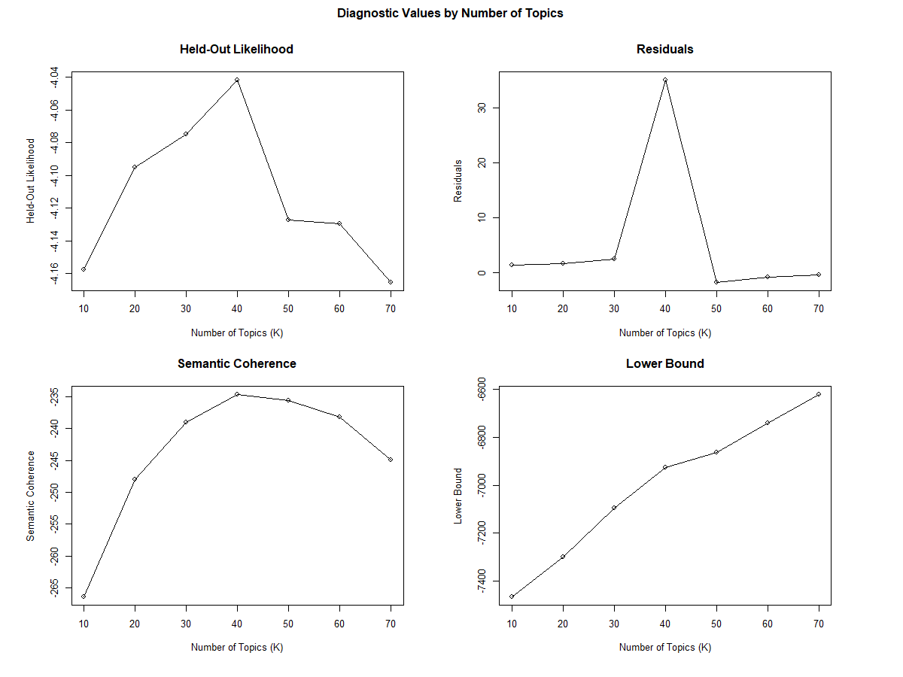
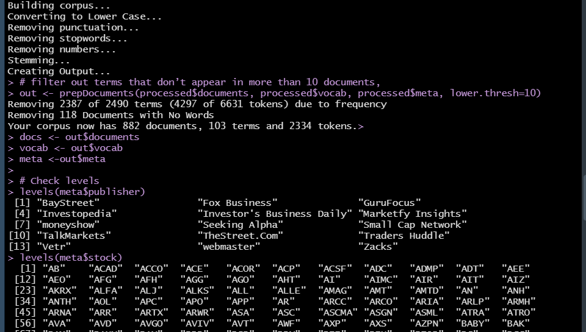

# Structural-Topic-Modeling-in-R

**Topic models** allow us to summarize unstructured text, find clusters (hidden topics) where each observation or document (in our case, news article) is assigned a (Bayesian) probability of belonging to a specific topic.

The most common form of topic modeling is LDA (Latent Dirichlet Allocation). Other techniques exist, such as Dynamic Topic Models, Correlated Topic Models, Hierarchical Topic Models.

**Structural topic modeling (STM)** has been increasing in popularity over recent years. STM is essentially LDA that employs metadata to improve word assignment to topics within a corpus (collection of news articles).

So we can easily say, **STM = LDA + metadata**.

# Code
https://github.com/trajceskijovan/Structural-Topic-Modeling-in-R/blob/main/Topical_Model_Jovan_Trajceski_May%202021.R

# Medium Articles
I have written two Medium articles on this topic.

Structural Topic Modeling with R - Part I: https://jovantrajceski.medium.com/structural-topic-modeling-with-r-part-i-2da2b353d362
Structural Topic Modeling with R - Part II: https://jovantrajceski.medium.com/structural-topic-modeling-with-r-part-ii-462e6e07328

# Dataset:
We will be using the Daily Financial News dataset published on Kaggle. The dataset includes approximately 2 million articles for 6000 stocks from 2009–2020.

There is an R package called stm, which provides almost everything we need for our first Structural Topic Model.

Original dataset overview:

Let's randomly sample 1,000 rows out of the loaded dataset (feel free to reduce the sample size if your laptop can't handle it).

We will apply few preprocessing steps to our sample, including:
• Convert to lower case
• Remove Stop-Words
• Remove numbers
• Remove punctuation
• Words shorter than the minimum word length are discarded
• Stemming
• Replace all non-alphanumeric characters
• Create output

The processed object is a list of four objects: documents, vocab, meta, and docs removed. The document object is a list, one per document, of 2-row matrices; the first row indicates the index of a word found in the document, and the second row indicates the (nonzero) counts. If preprocessing causes any documents to be empty, they are removed, as are the corresponding rows of the meta-object.

Let's filter out terms that do not appear in more than ten documents (our threshold — you can change this as desired).

Also, we will level check for “publisher” and “stock” columns before proceeding with the structural topic model.

Our corpus now has 882 documents, 103 terms, and 2334 tokens:

